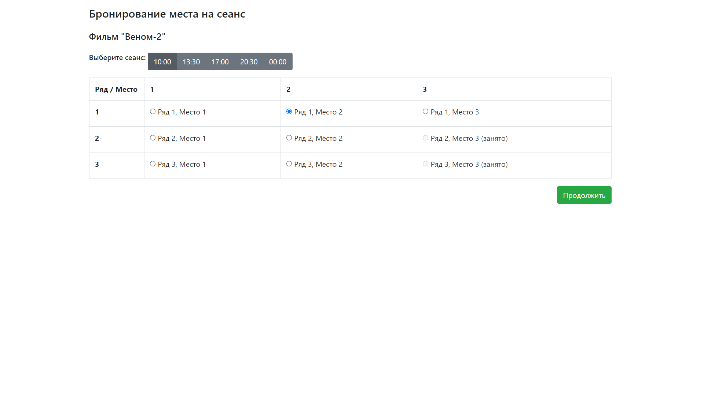
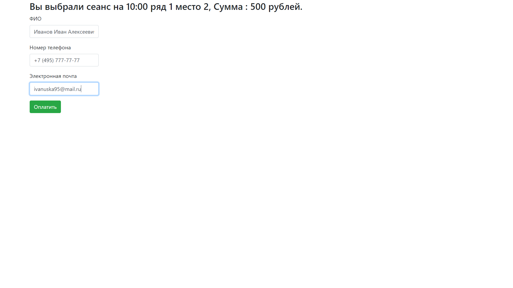
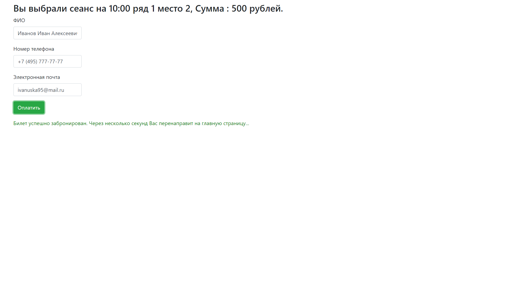
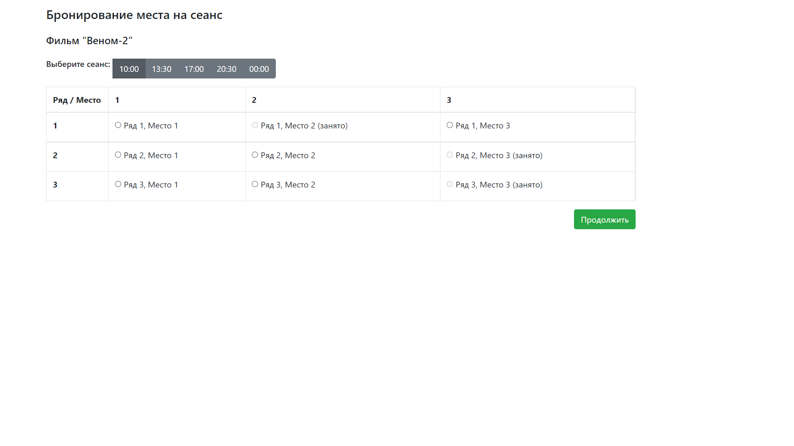
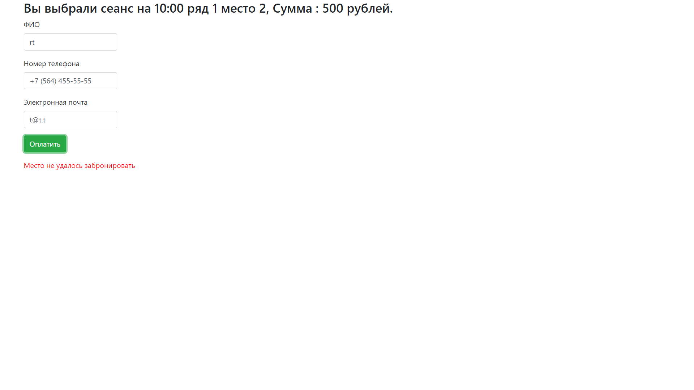

# job4j_cinema

Проект представляет собой сайт по покупкам билетов в кинотеатр.
На главной странице отображается список сеансов на фильм c возможностью бронирования места на конкретное время.
Места, которые уже заняты, отображаются на странице.

После выбора места, необходимо заполнить ФИО, телефон и email и нажать кнопку "Оплатить".

При успешном бронировании, осуществится перенаправление на главную страницу.

Где выбранное место будет отмечено как "занятое".

В случае, если бронирование не удалось, клиент получит вывод сообщения об этом.

